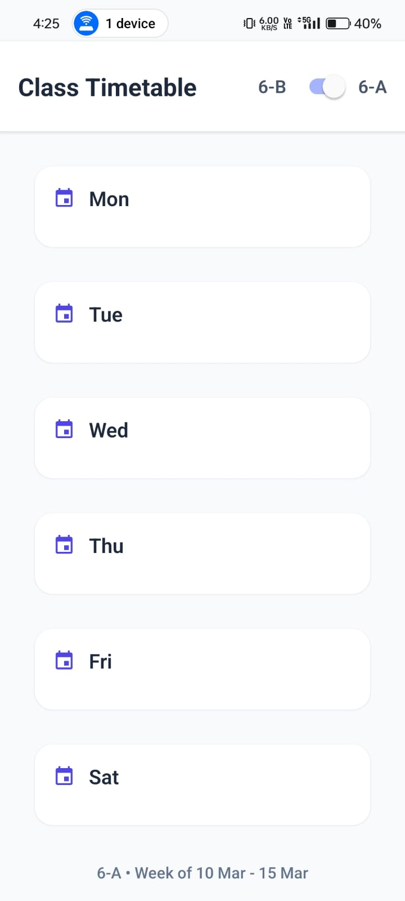

# 📅 React Native Timetable App  

_A simple React Native app to view a weekly timetable with an immersive UI._

---

## 📌 Features  
✅ View timetable for each day (Monday - Saturday).  
✅ Click on a day button to view the schedule in an immersive manner.  
✅ Built using **React Native** and **Expo** for smooth performance.  
✅ Responsive and easy to navigate.  

---

## 📸 Screenshots  

| Home Screen  | Timetable View |
|-------------|-------------|
|  |  |

🔹 _Click on a day to see its schedule in detail._

---

## 📥 Download APK  
🔗 **[Download the latest APK](https://drive.google.com/file/d/1-_6QFA8-_BwfT72bl0PJRyAwbFodRNxH/view?usp=sharing)**  


## 🚀 Getting Started  

### 1️⃣ Clone the Repository  
```sh
git clone https://github.com/vaibhavk121/time_table_app.git
cd time_table_app
```

###2️⃣ Install Dependencies
```sh
npm install

